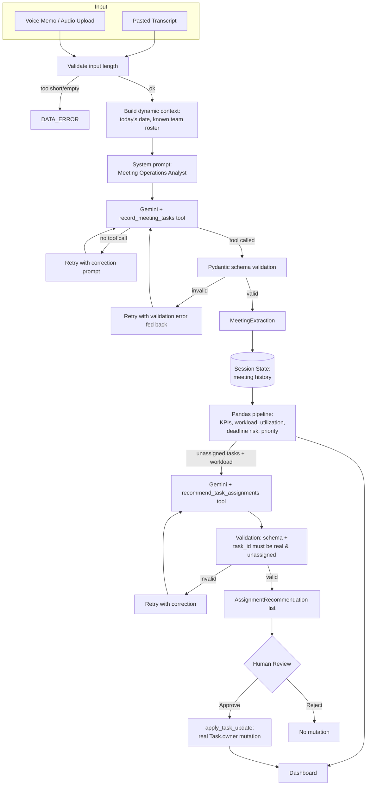

```
 ███████╗██╗   ██╗███╗   ██╗ █████╗ ██████╗ ███████╗███████╗
 ██╔════╝╚██╗ ██╔╝████╗  ██║██╔══██╗██╔══██╗██╔════╝██╔════╝
 ███████╗ ╚████╔╝ ██╔██╗ ██║███████║██████╔╝███████╗█████╗
 ╚════██║  ╚██╔╝  ██║╚██╗██║██╔══██║██╔═══╝ ╚════██║██╔══╝
 ███████║   ██║   ██║ ╚████║██║  ██║██║     ███████║███████╗
 ╚══════╝   ╚═╝   ╚═╝  ╚═══╝╚═╝  ╚═╝╚═╝     ╚══════╝╚══════╝

 $ turn meeting chaos into an accountable action plan.
```

[]()
[]()
[]()
[]()

---
# Synapse

> Turn meeting chaos into accountable action.

🚀 **Live Demo:** https://synapse-capstone.streamlit.app/

## Overview
...

## Overview

**Synapse** is an AI operations dashboard that turns raw meeting input — a
pasted transcript, or a spoken voice memo — into a validated, trackable set
of action items, with an AI-assisted (human-approved) owner-assignment
workflow layered on top.

It was built as a capstone project against a defined evaluation rubric
(Streamlit UI, Git, data visualization, and Gemini AI integration
including multimodality), but it's designed to be a real, usable tool —
not a rubric checklist wearing a UI.

### The problem

Meeting notes are messy. Action items get buried in a wall of text (or a
voice memo nobody transcribes), ownership is implicit or missing, and
nobody circles back until something's already late.

### The solution

Paste a transcript or record a voice memo → Synapse extracts structured
action items via Gemini function-calling (not free-text chat) → a
deterministic Pandas layer computes workload, utilization, and deadline
risk → an AI recommendation engine suggests owners for anything
unassigned, with visible reasoning → **a human explicitly approves or
rejects every recommendation** before anything about a task's ownership
changes.

### What makes this different from "call an LLM, show the response"

- Gemini reports results through **structured tool calls** (`record_meeting_tasks`,
  `recommend_task_assignments`), validated against Pydantic schemas, with
  automatic retry-with-correction on malformed output — not parsed free text.
- **Every AI output is human-gated.** Extraction results are shown before
  they're final; assignment recommendations require an explicit Approve
  click, and a stale-guard invariant prevents approving a recommendation
  that was generated against a task list that has since changed.
- **Deterministic math never goes through the model.** Workload totals,
  utilization percentages, overdue detection — all plain Pandas, computed
  in `utils/data_pipeline.py`. Gemini is only asked for things that
  genuinely require reasoning: extraction and assignment judgment.

---

## Features

- 📝 **Text extraction** — paste a transcript, get structured tasks with
  owner, priority, deadline, and a source excerpt for verification.
- 🎙️ **Voice extraction** — record or upload a voice memo; Gemini's
  native audio understanding extracts tasks directly, no separate
  transcription step, using the *same* validated schema as text input.
- 📊 **Live dashboard** — KPI cards with deltas since your last meeting,
  workload and priority charts, and a deadline-risk table.
- ✏️ **Editable task board** (`st.data_editor`) — correct owner, priority,
  status, or deadline inline; edits are validated before being applied.
- 🤖 **AI assignment recommendations** — for unassigned tasks, Gemini
  reasons over current team workload and task context, and proposes an
  owner with a rationale, a confidence score, and an alternative
  candidate — for a human to approve or reject.
- 🔍 **Agent trace panel** — see exactly what Gemini did on the last call:
  every attempt, every tool call, every argument.
- 🛡️ **Never crashes on bad AI output** — a formal error taxonomy
  (`DATA_ERROR` / `AI_API_ERROR` / `AI_OUTPUT_ERROR` / `VALIDATION_ERROR`)
  drives friendly, specific error messages; raw tracebacks are never shown.

---

## Architecture

```
synapse/
├── app.py                    # Composition/orchestration layer ONLY
├── components/                # UI — st.form, st.data_editor, charts, panels
│   ├── input_panel.py          # Text + audio submission forms (the only
│   │                           #   place that triggers a Gemini call)
│   ├── kpi_cards.py             # KPI strip with deltas
│   ├── charts.py                # Workload / priority / deadline-risk views
│   ├── task_board.py            # Editable task table (data_editor)
│   ├── ai_panel.py              # Recommendation engine trigger + approval UI
│   └── agent_trace.py           # Raw tool-call trace expander
├── services/
│   ├── gemini_service.py        # ALL Gemini calls live here. Shared retry
│   │                           #   loop, error taxonomy, extraction (text
│   │                           #   + audio), assignment recommendations.
│   └── tools.py                  # Gemini function-calling tool schemas +
│                                #   payload validation (imports models/
│                                #   schemas.py, never redefines it)
├── models/
│   └── schemas.py                # Single source of truth: Task,
│                                #   MeetingExtraction, AssignmentRecommendation,
│                                #   ExtractionError. Pydantic-validated.
├── utils/
│   ├── data_pipeline.py          # ALL deterministic math. Pure functions,
│   │                           #   empty-input safe, no AI, no viz.
│   ├── session.py                # st.session_state, split into explicit
│   │                           #   DATA / UI / AI / APPROVAL state, with a
│   │                           #   stale-recommendation guard.
│   └── errors.py                 # Human-readable error message mapping
├── tests/                      # See Testing section below
├── assets/style.css             # Minimal custom styling
├── .streamlit/config.toml       # Theme + deployment config
├── requirements.txt
├── .env.example
└── .gitignore
```

**Why this split:** `app.py` never contains business logic — it wires
components together and nothing else. `services/gemini_service.py` is the
only file that talks to the Gemini API. `utils/data_pipeline.py` is the
only file that does math. `models/schemas.py` is the only file that
defines what a Task *is* — everything else imports it, nothing redefines
it. This was audited explicitly during development for circular imports,
duplicated schemas, and UI/business-logic mixing.

### AI pipeline



---

## Tech Stack

| Layer | Choice |
|---|---|
| UI framework | Streamlit |
| AI | Google Gemini 2.0 Flash (`google-genai` SDK), function-calling |
| Data validation | Pydantic v2 (`validate_assignment=True` on `Task`) |
| Data processing | Pandas |
| Deployment target | Streamlit Community Cloud |

---

## Installation

```bash
git clone <your-repo-url>
cd synapse
python -m venv .venv
source .venv/bin/activate   # Windows: .venv\Scripts\activate
pip install -r requirements.txt
```

## Environment Variables / Gemini Setup

Copy `.env.example` to `.env` and add your key:

```bash
cp .env.example .env
```

```
GEMINI_API_KEY=your-actual-key-here
```

Get a key at [Google AI Studio](https://aistudio.google.com/apikey).

On **Streamlit Community Cloud**, set this instead via your app's
**Settings → Secrets**:

```toml
GEMINI_API_KEY = "your-actual-key-here"
```

The app never hardcodes a key and never logs one — `services/gemini_service.py`
reads `st.secrets` first, falls back to the environment, and raises a
friendly (non-crashing) error if neither is set.

## Usage

```bash
streamlit run app.py
```

1. Paste a transcript (or record/upload a voice memo) and click **Extract
   Action Items**.
2. Review the extracted tasks on the dashboard; edit anything inline via
   the task board.
3. If tasks are unassigned, click **Generate Assignment Recommendations**
   in the AI panel, then **Approve** or **Reject** each suggestion.
4. Process more meetings — the dashboard, KPIs, and workload view update
   across your whole session history.

## Screenshots

*Not included in this submission — this project was built and tested in
an offline sandbox without a live Streamlit runtime available (see
Testing and Limitations below). Screenshots should be captured after the
first local `streamlit run app.py` and added here before final submission.*

## Deployment (Streamlit Community Cloud)

1. Push this repo to GitHub.
2. On [share.streamlit.io](https://share.streamlit.io), create a new app
   pointing at `app.py`.
3. Add `GEMINI_API_KEY` under **Settings → Secrets**.
4. Deploy. `requirements.txt` has no local-only dependencies.

## Testing

Run the full test suite (no Streamlit/pydantic/network required — see
below):

```bash
for f in tests/test_*.py; do python3 "$f"; done
```

**What's covered, and how — read this section before trusting a green
run:**

| Test file | What it verifies |
|---|---|
| `test_session.py` | Session state transitions, the stale-recommendation guard, safe reset |
| `test_gemini_service.py` | The Gemini retry loop's control flow and error taxonomy, against a scripted fake client |
| `test_input_panel.py` | Text + audio submission orchestration, KPI-snapshot timing, team-roster propagation |
| `test_task_board.py` | The `data_editor` diff-detection logic, including a real pandas Timestamp/date type mismatch edge case |
| `test_app_wiring.py` | `app.main()` runs clean end-to-end (empty + populated states), and the full recommend → approve → mutation / recommend → reject → no mutation flow |

**Important honesty note:** this project was developed in an offline
sandbox with no network access and neither `streamlit`, `pydantic`, nor
`google-genai` installed. Every test above mocks those dependencies
(lightweight dataclass stand-ins for Pydantic models, a scripted fake
Gemini client, a hand-built Streamlit API mock) to verify **logic** —
state transitions, retry behavior, diffing, wiring between modules. This
is real and meaningful testing, but it is **not** a substitute for
running the actual app: real Pydantic validation behavior, real
Streamlit widget rendering/rerun semantics, and a real Gemini API call
have not been executed. Before considering this "verified," run:

```bash
pip install -r requirements.txt
streamlit run app.py
# and manually smoke-test: text extraction, audio extraction,
# task editing, and the recommend/approve/reject flow with a real key.
```

## Limitations

- Session data is **in-memory only** — refreshing the browser or
  restarting the app loses all processed meetings. There is no database.
- The assignment-recommendation engine only considers workload and task
  description text — it has no notion of actual skills/roles beyond what
  can be inferred from a task's wording.
- `st.audio_input` (live mic recording) requires Streamlit 1.38+; on
  older versions the app gracefully falls back to file-upload-only for
  the voice input path.
- Not yet runtime-verified against the live Gemini API or a real
  Streamlit session (see Testing above) — do this before a live demo.

## Future Improvements

- Persistent storage (a real database) so history survives a restart.
- Multi-user support with per-user session isolation.
- Slack/email export of the task board.
- A lightweight "skills" tag per team member to make assignment
  recommendations genuinely skill-aware, not just workload-aware.

---

## Final Rubric Self-Audit

See `RUBRIC_AUDIT.md` for the complete, hostile-evaluator-style scoring
breakdown and an honest list of what would cost marks.

---

```
$ status: functional, tested (with the scope caveats above), demo-ready
$ built for the MirAI School of Technology Capstone
```
